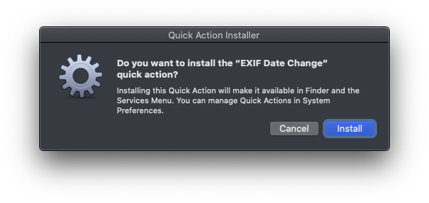

# EXIF Date Change.workflow for macOS


---

## Prerequisites

1. Install [homebrew](https://brew.sh/)
1. Install [exiftool](https://exiftool.org/) with homebrew: `brew install exiftool`

## Quickstart

1. download and unzip [EXIF Date Change.workflow.zip](https://github.com/rajannpatel/EXIF-Date-Change.workflow-for-macOS/raw/master/EXIF%20Date%20Change.workflow.zip)
1. open **EXIF Date Change.workflow** with the default application: **Automator Installer.app**
1. right click any folder(s) or file(s) to run the EXIF Date Change Quick Action.

## Installation

### Choose an installation method:

#### Option A: zsh

```zsh
unzip =( curl https://github.com/rajannpatel/EXIF-Date-Change.workflow-for-macOS/raw/master/EXIF%20Date%20Change.workflow.zip -L ) && open EXIF\ Date\ Change.workflow
```

#### Option B: bash

```bash
curl https://github.com/rajannpatel/EXIF-Date-Change.workflow-for-macOS/raw/master/EXIF%20Date%20Change.workflow.zip -L -o workflow.zip
unzip workflow.zip
rm workflow.zip
open EXIF\ Date\ Change.workflow
```

Once this installation completes you can remove **EXIF Date Change.workflow** using this command:

```bash
rm -rf EXIF\ Date\ Change.workflow
```

#### Option C: git

```bash
git clone -n git@github.com:rajannpatel/EXIF-Date-Change.workflow-for-macOS.git --depth 1
cd EXIF-Date-Change.workflow-for-macOS
git checkout HEAD "EXIF Date Change.workflow.zip"
unzip "EXIF Date Change.workflow.zip"
open EXIF\ Date\ Change.workflow
```

Once this installation completes you can remove the **EXIF-Date-Change.workflow-for-macOS** directory using this command:

```bash
cd ..
rm -rf EXIF\ Date\ Change.workflow
```

### Approve the installation

