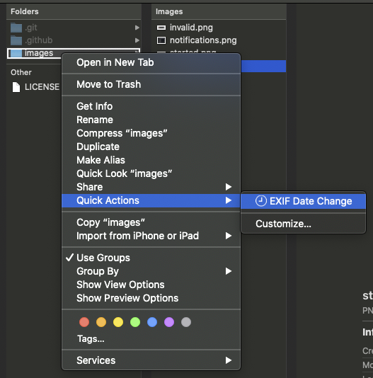

# EXIF Date Change.workflow for macOS

Right click file(s) or folder(s) to perform an EXIF Date Change on one, or many files.



**POSSIBLY USEFUL:** I have also authored an [EXIF Date Read.workflow for macOS](https://github.com/rajannpatel/EXIF-Date-Read.workflow-for-macOS)

---

## Prerequisites

1. Install [homebrew](https://brew.sh/): `/bin/bash -c "$(curl -fsSL https://raw.githubusercontent.com/Homebrew/install/master/install.sh)"`
1. Install [exiftool](https://exiftool.org/) with homebrew: `brew install exiftool`
1. Users not running macOS 10.15 Catalina will need to install **zsh** with homebrew: `brew install zsh`

## Quickstart

1. download and unzip [EXIF Date Change.workflow.zip](https://github.com/rajannpatel/EXIF-Date-Change.workflow-for-macOS/raw/master/EXIF%20Date%20Change.workflow.zip)
1. open **EXIF Date Change.workflow** with the default application: **Automator Installer.app**
1. right click any folder(s) or file(s) and click **Quick Action** > **EXIF Date Change**

## Installation

### Choose an installation method:

#### Option A: zsh

```zsh
unzip =( curl https://github.com/rajannpatel/EXIF-Date-Change.workflow-for-macOS/raw/master/EXIF%20Date%20Change.workflow.zip -L ) && open EXIF\ Date\ Change.workflow
```

#### Option B: bash

```bash
curl https://github.com/rajannpatel/EXIF-Date-Change.workflow-for-macOS/raw/master/EXIF%20Date%20Change.workflow.zip -L -o workflow.zip
unzip workflow.zip
rm workflow.zip
open EXIF\ Date\ Change.workflow
```

Once this installation completes you can remove **EXIF Date Change.workflow** using this command:

```bash
rm -rf EXIF\ Date\ Change.workflow
```

#### Option C: git

```bash
git clone -n git@github.com:rajannpatel/EXIF-Date-Change.workflow-for-macOS.git --depth 1
cd EXIF-Date-Change.workflow-for-macOS
git checkout HEAD "EXIF Date Change.workflow.zip"
unzip "EXIF Date Change.workflow.zip"
open EXIF\ Date\ Change.workflow
```

Once this installation completes you can remove the **EXIF-Date-Change.workflow-for-macOS** directory using this command:

```bash
cd ..
rm -rf EXIF\ Date\ Change.workflow
```

### Approve the installation


### Confirm Installation Succeeded

If you don't see **EXIF Date Change** in **System Preferences** > **Extensions** > **Finder** just like the screenshot below, you may need to run the `open EXIF\ Date\ Change.workflow` command again, or double click it to run it.


## Usage

Using **Finder.app** you can right click on any file(s) or folder(s) with images to change the EXIF Date. Your original files will be updated with the new date:


You can press **ESC** to exit without making any changes. If you enter an incorrect date, you  will be provided an error message:


If the date validation step passes, when the date changing task begins, you will get the following notifications:


The notifications panel will retain a history of your edits:


